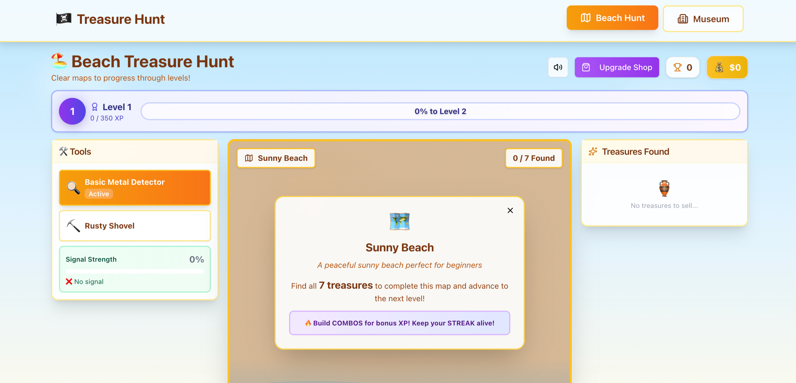
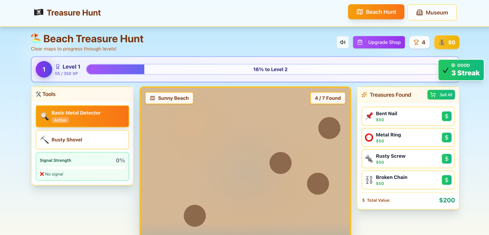
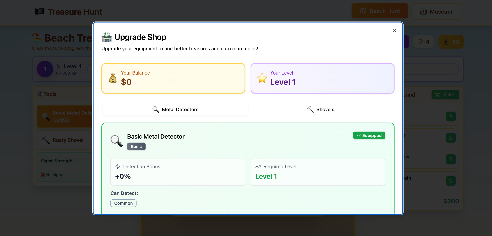
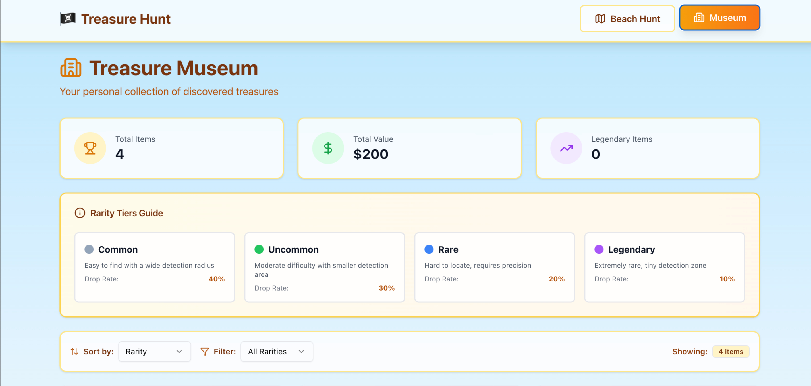

# 🏴‍☠️ Treasure Hunt

A treasure-hunting game built with Base44!  
Grab your metal detector, hit the sandy beach, and uncover hidden loot as you level up, upgrade your gear, and chase massive combos!

  
## 🎮 Gameplay Overview

You begin with a basic metal detector and a stretch of beach sand.
Every dig can uncover:

* Common items  
* Rare relics  
* Ultra-valuable treasures  
* Combo-boosting bonuses  

As you scan and dig, you build combo chains, earn coins, and unlock levels, zones, and gear upgrades.

  
## 🛠️ Tech Stack

* React 
* Local storage

  
## 🚀 Future Plans

* New maps
* Unlockable tools beyond metal detectors
* Rare mythic items

  
## Screenshots

#### Home

#### Playing

#### Upgrade Shop

#### Museum

  
## 💻 Installation

    git clone https://github.com/alfinaim/Treasure-Hunt.git
    cd Treasure-Hunt
    npm install
    npm start
